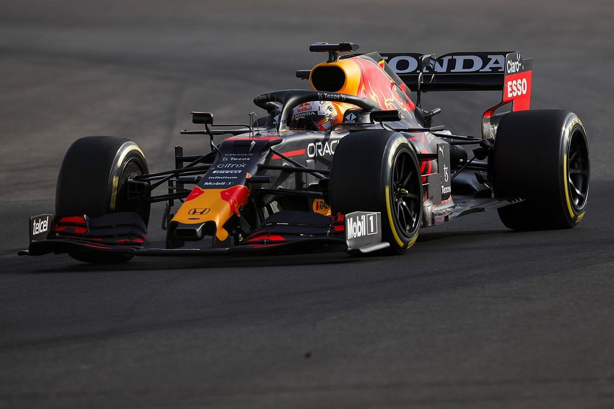

# Lab_1 Machine Vision

### This repository contains a Colab notebook script for various image processing tasks completed for Lab_1 in the Machine Vision

Colab link: 

Colab notebook: '[Lab_1 Notebook](./Lab_1.ipynb)' 

The image used in the notebook is provided as '[Lab_1_1 image](./Lab_1_1.jpg)'

